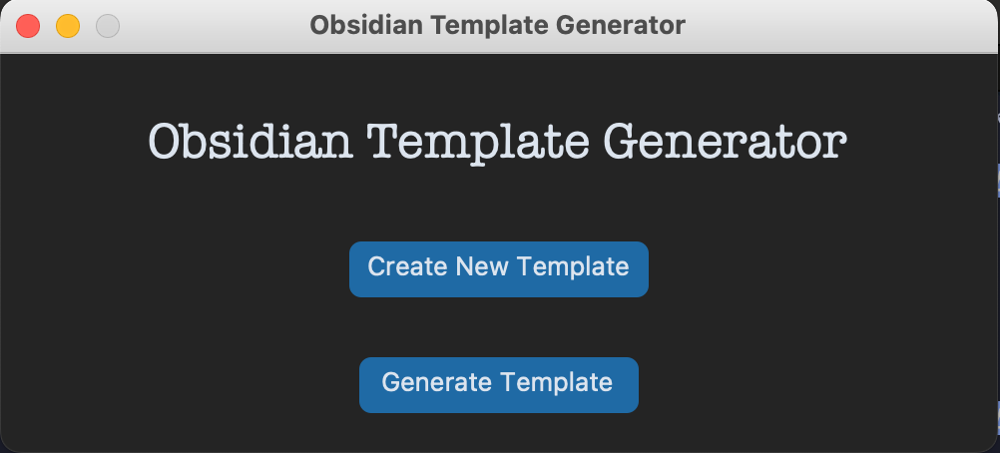
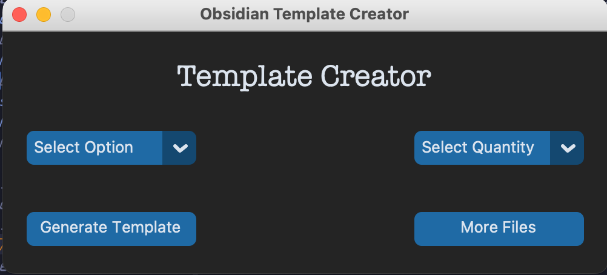

<h1 style = "text-align: center"> Obsidian Vault Generator </h1>

<p> Obsidian Vault Generator is a standalone program that can reduce that time it takes to create an obsidian vault.</p>
<p>If you have to generate a vault over and over again. This is the program for you. All you have to do is specify the items using the Obsidian Vault Generator, the program will then generate the vault configuration for you in the form of a JSON file. The next time you want to create that specific vault, you will not have to go to ObsidianMD to create the vault manually. You can use  the Obsidian Vault Generator and a few seconds later, you will have your vault.</p>


<h2> Installation💾 </h2>

- Mac Users 🍎</br>
1. 
```
  cd MacOS
```
2.
```
  ./build.sh
```

- Windows Users 🪟 </br>
1.
```
  cd Windows
```
2.
```
  .\build.ps1
```

<h2> Technologies used🧑🏻‍💻 </h2>

1. [Python 🐍](https://www.python.org/) 

2. [tkinter](https://docs.python.org/3/library/tkinter.html)

3. [Customtkinter](https://github.com/tomschimansky/customtkinter)

4. [PathValidate](https://pypi.org/project/pathvalidate/)

<h2>Future Plans 📝</h2>

1. Adding support for importing different media into vault

2. Adding support for additional functionalities regarding Canva file type

3. Creating Unit Test to ensure the program is bug free and functioning as intended.

<h2>Screenshots 📸</h2>

1. 


2. 
